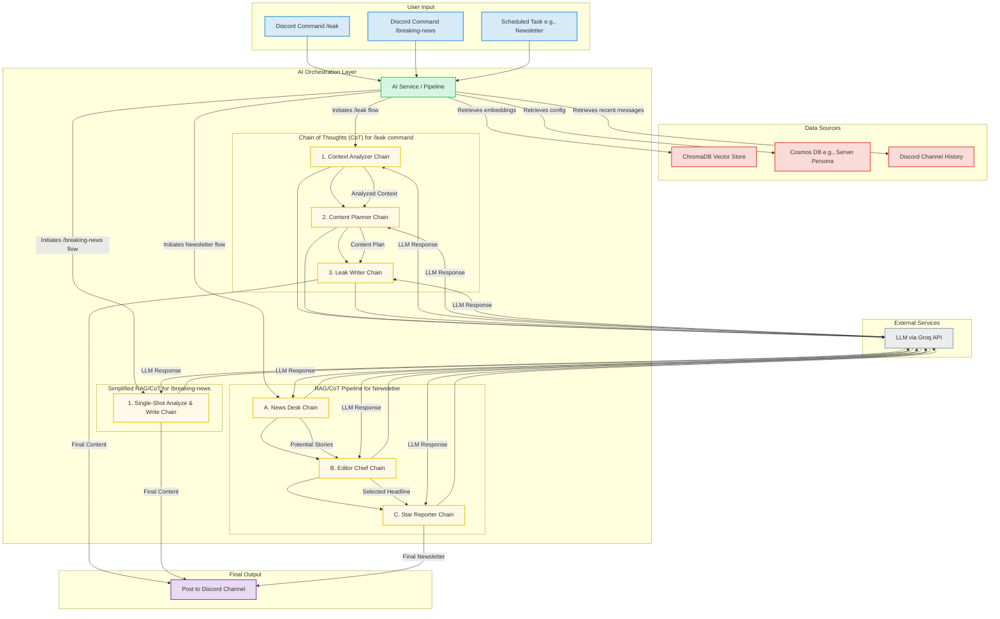

# LLM Interaction Flow

This diagram illustrates the high-level interaction between different services and the Large Language Model (LLM) to generate content. It shows how user commands or scheduled tasks trigger different Chain of Thoughts (CoT) and Retrieval-Augmented Generation (RAG) pipelines.

