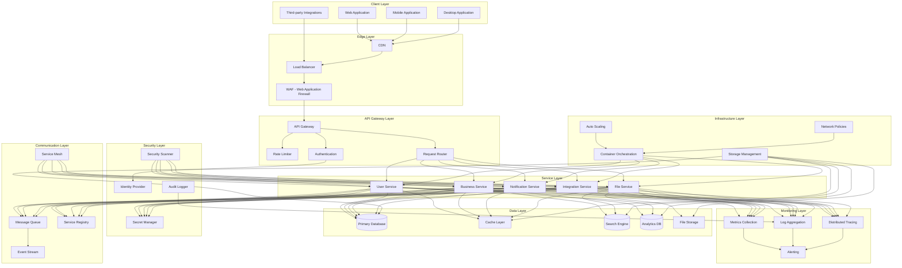
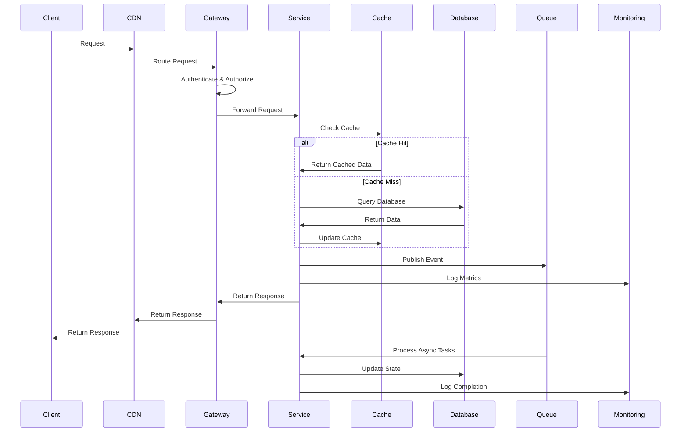
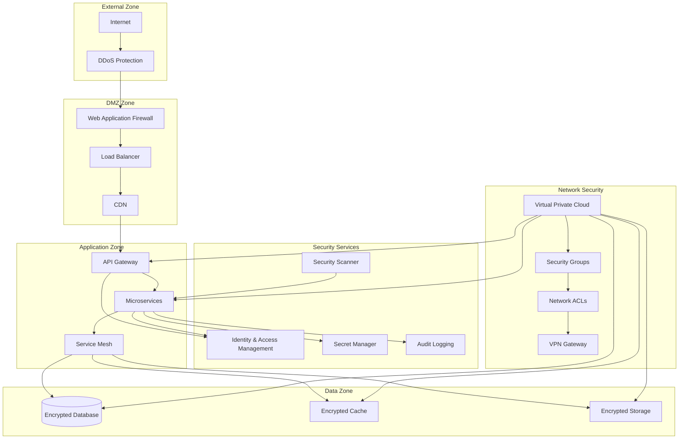

# System Architecture Mermaid Diagram

## Complete System Architecture

```mermaid
graph TB
    %% External Clients
    Web[Web App]
    Mobile[Mobile App]
    Desktop[Desktop App]
    ThirdParty[Third Party APIs]
    
    %% CDN and Load Balancer
    CDN[Content Delivery Network]
    LB[Load Balancer]
    
    %% API Gateway Layer
    Gateway[API Gateway<br/>- Authentication<br/>- Rate Limiting<br/>- Routing]
    
    %% Microservices Layer
    UserService[User Management<br/>Service]
    BusinessService[Business Logic<br/>Services]
    NotificationService[Notification<br/>Service]
    FileService[File Processing<br/>Service]
    IntegrationService[Integration<br/>Services]
    
    %% Message Queue and Event System
    MessageQueue[Message Queue<br/>RabbitMQ/Kafka]
    EventStream[Event Stream<br/>Apache Kafka]
    
    %% Service Registry
    ServiceRegistry[Service Registry<br/>& Discovery]
    
    %% Caching Layer
    Cache[Cache Layer<br/>Redis/Memcached]
    
    %% Database Layer
    PrimaryDB[(Primary Database<br/>PostgreSQL)]
    SearchDB[(Search Engine<br/>Elasticsearch)]
    AnalyticsDB[(Data Warehouse<br/>Analytics)]
    
    %% File Storage
    FileStorage[Object Storage<br/>AWS S3/Azure Blob]
    
    %% Security Services
    AuthService[Authentication<br/>Service]
    SecretManager[Secret Manager]
    
    %% Monitoring and Logging
    Monitoring[Monitoring<br/>Prometheus/Grafana]
    Logging[Logging<br/>ELK Stack]
    
    %% Infrastructure
    K8s[Kubernetes Cluster]
    ServiceMesh[Service Mesh<br/>Istio]
    
    %% CI/CD
    CICD[CI/CD Pipeline<br/>Jenkins/GitLab]
    
    %% Connections
    Web --> CDN
    Mobile --> CDN
    Desktop --> CDN
    CDN --> LB
    LB --> Gateway
    
    Gateway --> UserService
    Gateway --> BusinessService
    Gateway --> NotificationService
    Gateway --> FileService
    Gateway --> IntegrationService
    
    UserService --> MessageQueue
    BusinessService --> MessageQueue
    NotificationService --> MessageQueue
    FileService --> MessageQueue
    IntegrationService --> MessageQueue
    
    MessageQueue --> EventStream
    
    UserService --> Cache
    BusinessService --> Cache
    NotificationService --> Cache
    FileService --> Cache
    
    UserService --> PrimaryDB
    BusinessService --> PrimaryDB
    NotificationService --> PrimaryDB
    FileService --> PrimaryDB
    
    BusinessService --> SearchDB
    FileService --> SearchDB
    
    BusinessService --> AnalyticsDB
    UserService --> AnalyticsDB
    
    FileService --> FileStorage
    
    Gateway --> AuthService
    UserService --> AuthService
    BusinessService --> AuthService
    NotificationService --> AuthService
    FileService --> AuthService
    IntegrationService --> AuthService
    
    UserService --> ServiceRegistry
    BusinessService --> ServiceRegistry
    NotificationService --> ServiceRegistry
    FileService --> ServiceRegistry
    IntegrationService --> ServiceRegistry
    
    IntegrationService --> ThirdParty
    
    UserService --> SecretManager
    BusinessService --> SecretManager
    NotificationService --> SecretManager
    FileService --> SecretManager
    IntegrationService --> SecretManager
    
    UserService --> Monitoring
    BusinessService --> Monitoring
    NotificationService --> Monitoring
    FileService --> Monitoring
    IntegrationService --> Monitoring
    Gateway --> Monitoring
    
    UserService --> Logging
    BusinessService --> Logging
    NotificationService --> Logging
    FileService --> Logging
    IntegrationService --> Logging
    Gateway --> Logging
    
    %% Infrastructure connections
    K8s --> ServiceMesh
    ServiceMesh --> UserService
    ServiceMesh --> BusinessService
    ServiceMesh --> NotificationService
    ServiceMesh --> FileService
    ServiceMesh --> IntegrationService
    
    CICD --> K8s
    
    %% Styling
    classDef client fill:#e1f5fe
    classDef gateway fill:#f3e5f5
    classDef service fill:#e8f5e8
    classDef data fill:#fff3e0
    classDef infra fill:#fce4ec
    classDef security fill:#ffebee
    classDef monitoring fill:#f1f8e9
    
    class Web,Mobile,Desktop,ThirdParty client
    class CDN,LB,Gateway gateway
    class UserService,BusinessService,NotificationService,FileService,IntegrationService,MessageQueue,EventStream,ServiceRegistry service
    class Cache,PrimaryDB,SearchDB,AnalyticsDB,FileStorage data
    class K8s,ServiceMesh,CICD infra
    class AuthService,SecretManager security
    class Monitoring,Logging monitoring
```

## Detailed Layer Architecture

## Data Flow Diagram

## Security Architecture

This comprehensive architecture provides a robust foundation for a scalable, secure, and maintainable system.